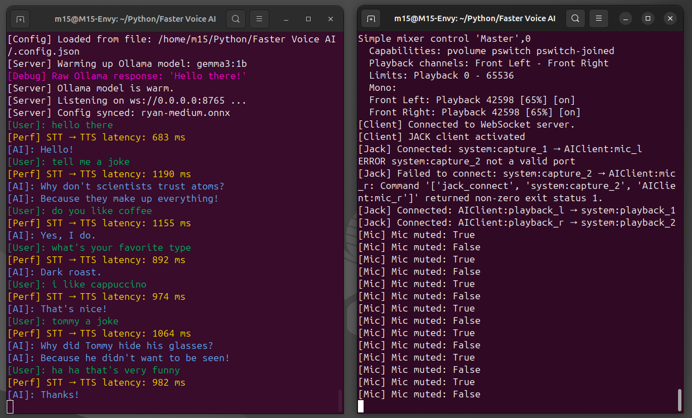

# Faster-Local-Voice-AI

A real-time, local voice AI system optimized to run on an Ubuntu laptop with 8Gb Ram and no GPU, achieving less than 1 second STT to TTS latency. It leverages a WebSocket client/server architecture, utilizes Gemma3:1b via Ollama for the language model, Vosk for offline speech-to-text, and Piper for text-to-speech. The system also employs JACK/PipeWire for low-latency I/O. Inspired by advancements from AssemblyAI, ElevenLabs, Fixie, and LiveKit, this project aims for full localization. The current architecture does not support interruption logic.



`Screenshot: Server.py (left) and Client.py (right)`

## Features
- **Low Latency**: Sub-second end-to-end processing for speech-to-text (STT) and text-to-speech (TTS).
- **Fully Local**: Runs entirely offline with no cloud dependencies.
- **Configurable**: Adjustable via `.config.json` for model, voice, prompts, and audio settings.
- **Streaming Response**: Handles streaming LLM responses and TTS for natural conversation flow.
- **Audio Fading**: Smooth audio transitions with configurable fade durations.
- **History Support**: Optional chat history retention for context-aware responses.

## Dependencies
This project requires several external tools and libraries. You are responsible for installing and configuring them:

- **Python 3.11**: The core runtime.
- **Ollama**: For local LLM inference. Install from [ollama.com](https://ollama.com) and pull the model: `ollama pull gemma3:1b`.
- **Vosk**: For offline STT. Install via pip (`pip install vosk`) and download a model (e.g., vosk-model-en-us-0.22) to the `vosk-model` directory.
- **Piper**: For TTS. Download from [rhasspy/piper](https://github.com/rhasspy/piper) and update `PIPER_PATH` in `server.py` to point to your installation. Place voice models (e.g., `ryan-medium.onnx`) in the `voices/` directory.
- **JACK Audio Server**: For low-latency audio I/O. Install via `sudo apt install jackd2` (on Ubuntu).
- **PipeWire**: For JACK compatibility and audio routing. Install via `sudo apt install pipewire pipewire-jack` and ensure it's running.
- **SoX**: For audio processing. Install via `sudo apt install sox`.
- **Python Packages**: Listed in `requirements.txt`. Install with `pip install -r requirements.txt`.

Additional setup:
- Ensure JACK is configured and running (e.g., via `jackd` or PipeWire's JACK emulation).
- Download Vosk models from [alphacephei.com/vosk/models](https://alphacephei.com/vosk/models).
- Download Piper voices from [rhasspy/piper voices](https://github.com/rhasspy/piper/blob/master/VOICES.md).

## Installation
1. Clone the repository:
   ```
   git clone https://github.com/yourusername/Faster-Local-Voice-AI.git
   cd Faster-Local-Voice-AI
   ```

2. Install Python dependencies:
   ```
   pip install -r requirements.txt
   ```

3. Set up directories:
   - Create `vosk-model/` and place your Vosk model files there.
   - Create `voices/` and place your Piper voice models (e.g., `.onnx` and `.json` files) there.

4. Install and configure the external dependencies as listed above.

5. Update paths in the code if needed (e.g., `PIPER_PATH` in `server.py`).

## Usage
1. Start the server (handles STT, LLM inference, and TTS):
   ```
   python server.py
   ```
   - The server listens on `ws://0.0.0.0:8765`.
   - It warms up the Ollama model on startup.

2. In a separate terminal, start the client (handles audio I/O via JACK):
   ```
   pw-jack python client.py
   ```
   - The client connects to the WebSocket server and syncs configuration.
   - Speak into your microphone to interact; the AI will respond via audio output.

3. Interact:
   - Say something (e.g., "Hello, how are you?").
   - The system processes your speech, generates a response via Ollama, and speaks it back.
   - Press Ctrl+C to exit.

Note: Ensure JACK/PipeWire is running and ports are connected (the client attempts auto-connection). The `pw-jack` prefix is used to run the client under PipeWire's JACK compatibility layer for optimal low-latency performance.

## Configuration
Copy the `config.json` file to `.config.json`.

Edit `.config.json` to customize the system:

```json
{
  "volume": 65,  // System volume (0-100)
  "mic_name": "",  // Microphone device name (leave empty for default)
  "audio_output_device": "",  // Output device name (leave empty for default)
  "model_name": "gemma3:1b",  // Ollama model name
  "voice": "ryan-medium.onnx",  // Piper voice model file (in voices/)
  "mute_mic_during_playback": true,  // Mute mic while AI is speaking
  "fade_duration_ms": 70,  // Fade in/out duration in ms for smooth audio
  "history_length": 0,  // Number of previous messages to keep in context (0 for none)
  "system_prompt": "You are a helpful voice assistant. Always give very short responses."  // LLM system prompt
}
```

## File Structure
- `server.py`: WebSocket server for STT (Vosk), LLM (Ollama), and TTS (Piper) processing.
- `client.py`: Audio client using JACK for mic input and playback output.
- `utils.py`: Helper functions for config loading, voice sample rates, and audio fading.
- `.config.json`: Configuration file (copy and edit as needed).
- `requirements.txt`: Python package requirements.
- `vosk-model/`: Directory for Vosk STT models (not included; download separately).
- `voices/`: Directory for Piper TTS voice models (not included; download separately).

## Troubleshooting
- **Audio Issues**: Verify JACK/PipeWire setup with `pw-link -l` or `jack_lsp`. Ensure ports are connected.
- **Model Not Found**: Check paths for Vosk and Piper models.
- **Latency Problems**: Adjust `FLUSH_INTERVAL`, `MAX_RESPONSE_LENGTH`, etc., in `server.py` for your hardware.
- **Errors**: Review console output for debug info (e.g., STDERR from Piper/Ollama).

## License
Copyright (c) 2025 m15.ai

This project is licensed under the MIT License - see the [LICENSE](LICENSE) file for details. (Note: Create a LICENSE file with the full MIT text if not already present.)

## Contributing
Contributions are welcome! Open issues or pull requests for improvements, bug fixes, or new features.

## Acknowledgments
Inspired by open-source AI tools and communities around local inference.